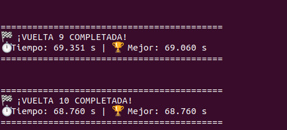
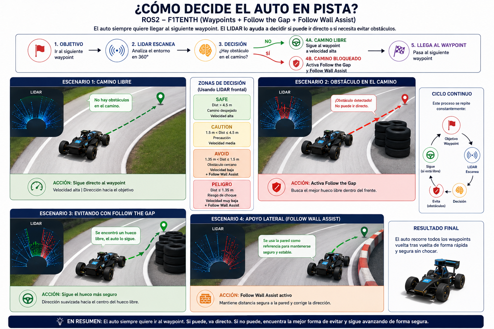

# F1TENTH Hybrid Reactive Controller (ROS2)



Controlador hibrido para vehiculos autonomos F1TENTH desarrollado en ROS2. El nodo combina seguimiento de waypoints, Follow the Gap, asistencia de pared y control adaptativo de velocidad para completar una vuelta evitando paredes, obstaculos estaticos y un oponente dinamico.

El objetivo principal no es solamente ir rapido, sino terminar la vuelta sin choque. Por eso el controlador prioriza seguridad cuando el LiDAR detecta el camino frontal o la ruta hacia el waypoint bloqueada, y vuelve a la raceline cuando el camino vuelve a estar libre.

---

# Resultado
 
El proyecto fue probado sobre el mapa de Sao Paulo con obstaculos. La imagen anterior corresponde a la mejor vuelta obtenida durante las pruebas.

parte 1: https://youtu.be/_nHY6Dqidew
parte 2: LINK : https://youtu.be/9GgGdCPfoaw 
---

# Arquitectura General



El flujo general del controlador es:

1. Leer LiDAR desde `/scan`.
2. Leer odometria desde `/ego_racecar/odom`.
3. Calcular el waypoint objetivo.
4. Revisar si el camino hacia ese waypoint esta libre.
5. Si esta libre, seguir la raceline.
6. Si esta bloqueado, activar Follow the Gap.
7. Si el estado llega a `PELIGRO`, aplicar asistencia de pared y repulsion.
8. Si el estado es de peligro, reducir velocidad y aplicar correcciones de seguridad.
9. Publicar comandos Ackermann en `/drive`.

---

# Componentes del Controlador

## Waypoints

Los waypoints definen la trayectoria principal de carrera. Estan definidos directamente en:

```text
reactive_race/reactive_race/raceline_follower.py
```

Dentro de la constante:

```python
WAYPOINTS = [
    (x, y),
    ...
]
```

El vehiculo intenta seguir estos puntos mientras el LiDAR confirma que el camino esta libre.

## Follow the Gap

Follow the Gap se activa cuando la ruta hacia el waypoint o la zona frontal esta bloqueada.

La version actual incluye:

- burbuja de seguridad alrededor del obstaculo mas cercano
- busqueda de huecos libres dentro del campo frontal
- margen interno para no apuntar al borde del hueco
- puntuacion por cercania al waypoint, distancia disponible, centro del hueco y suavidad
- suavizado del angulo elegido para evitar volantazos

## Follow Wall Assist

La asistencia de pared corrige el volante cuando el coche esta demasiado cerca de una pared lateral.

Se activa cuando:

- el estado es `PELIGRO`

Este modulo no reemplaza a Follow the Gap. Solo suma una correccion pequena para evitar roces o choques laterales.

## Control Adaptativo de Velocidad

La velocidad se decide usando la distancia libre hacia el waypoint y la zona frontal del LiDAR.

El controlador usa tres velocidades principales:

- `VELOCIDAD_MAXIMA` cuando el camino esta despejado
- `VELOCIDAD_CURVA` cuando hay distancia media o se esta esquivando
- `VELOCIDAD_PELIGRO` cuando el obstaculo esta demasiado cerca

Ademas, si el giro requerido es alto, limita la velocidad con `VELOCIDAD_CURVA_FUERTE`.

## Estados de Seguridad

| Estado | Condicion aproximada | Comportamiento |
|---|---:|---|
| `SEGURA` | camino libre mayor a 4.5 m | velocidad maxima |
| `CUIDADO` | distancia entre 1.5 m y 4.5 m | velocidad media |
| `PELIGRO` | distancia menor a 1.5 m | velocidad baja + asistencia de pared/repulsion |
| `ESQUIVE` | ruta bloqueada | Follow the Gap; asistencia de pared si tambien hay `PELIGRO` |

Nota: en esta version del codigo no existe un estado llamado `AVOID`. El comportamiento reactivo equivalente se maneja con `modo_esquive` y se identifica como `ESQUIVE`.

---

# Nodos ROS2

El paquete se llama:

```text
reactive_race
```

Incluye dos ejecutables principales:

```text
raceline_follower
raceline_obs
```

## raceline_follower

Controlador principal del vehiculo.

El nombre interno del nodo ROS2 es:

```text
corredor_hibrido_unificado
```

El ejecutable registrado en `setup.py` es:

```text
raceline_follower
```

Recibe:

```text
/scan
/ego_racecar/odom
```

Publica:

```text
/drive
```

Ejecuta:

- seguimiento de waypoints
- Follow the Gap
- asistencia de pared
- control de velocidad
- cronometro de vueltas

## raceline_obs

Nodo usado para mover un segundo robot/oponente durante las pruebas.

---

# Estructura del Proyecto

```text
f1thent-Follow-the-gap/
├── assets/
│   ├── mejorVuelta.png
│   └── referenciaProyecto.png
├── Mapa/
│   ├── SaoPaulo_mapObs.png
│   └── SaoPaulo_mapObs.yaml
├── reactive_race/
│   ├── package.xml
│   ├── setup.py
│   ├── setup.cfg
│   ├── run_follower.sh
│   └── reactive_race/
│       ├── raceline_follower.py
│       ├── raceline_obs.py
│       └── __init__.py
└── README.md
```

---

# Instalacion Desde Cero

Esta guia empieza desde cero: clonar este repositorio, compilar el proyecto y configurar el mapa en F1TENTH.

Se asume Ubuntu con ROS2 Humble y el simulador F1TENTH instalado.

El repositorio ya incluye el paquete ROS2 `reactive_race`, por lo que no es necesario copiarlo a otro workspace para compilarlo. Se compila directamente desde la carpeta clonada.

## 1. Instalar herramientas basicas

Si ya tienes `git`, `colcon` y ROS2 funcionando, puedes saltar este paso.

```bash
sudo apt update
sudo apt install -y git python3-colcon-common-extensions
```

Carga ROS2:

```bash
source /opt/ros/humble/setup.bash
```

## 2. Clonar este repositorio

Elige una carpeta para descargar el proyecto. Por ejemplo:

```bash
cd ~
```

Clona el repositorio:

```bash
git clone https://github.com/jcgallo1/f1thent-Follow-the-gap.git
```

Entra a la carpeta:

```bash
cd f1thent-Follow-the-gap
```

Verifica que tenga esta estructura:

```bash
ls
```

Debes ver:

```text
assets  Mapa  reactive_race  README.md
```

## 3. Compilar el proyecto

```bash
cd ~/f1thent-Follow-the-gap
source /opt/ros/humble/setup.bash
colcon build --packages-select reactive_race
```

Si quieres compilar todo lo que exista en el repositorio:

```bash
colcon build
```

## 4. Cargar el proyecto compilado

Cada terminal nueva debe cargar ROS2 y el workspace:

```bash
source /opt/ros/humble/setup.bash
source ~/f1thent-Follow-the-gap/install/setup.bash
```

Puedes verificar que ROS2 encuentra el paquete:

```bash
ros2 pkg list | grep reactive_race
```

---

# Instalacion del Mapa

El mapa del proyecto esta en:

```text
Mapa/
├── SaoPaulo_mapObs.png
└── SaoPaulo_mapObs.yaml
```

Para que F1TENTH lo use, estos archivos deben estar en la carpeta de mapas del simulador.

## 1. Encontrar la carpeta de mapas de F1TENTH

Las rutas comunes son:

```text
~/f1tenth_ws/src/f1tenth_gym_ros/maps
~/sim_ws/src/f1tenth_gym_ros/maps
```

Busca la carpeta con:

```bash
find ~ -type d -path "*f1tenth_gym_ros*maps" 2>/dev/null
```

Cuando encuentres la ruta, guardala en una variable. Por ejemplo:

```bash
export F1TENTH_MAPS=~/f1tenth_ws/src/f1tenth_gym_ros/maps
```

Si tu ruta es otra, cambia el valor de `F1TENTH_MAPS`.

## 2. Copiar los archivos del mapa

Desde la raiz de este proyecto:

```bash
cd ~/f1thent-Follow-the-gap
cp Mapa/SaoPaulo_mapObs.png "$F1TENTH_MAPS/"
cp Mapa/SaoPaulo_mapObs.yaml "$F1TENTH_MAPS/"
```

Verifica:

```bash
ls "$F1TENTH_MAPS" | grep SaoPaulo
```

## 3. Revisar el YAML del mapa

Abre:

```bash
nano "$F1TENTH_MAPS/SaoPaulo_mapObs.yaml"
```

La primera linea debe apuntar a la imagen que copiaste:

```yaml
image: SaoPaulo_mapObs.png
```

Si aparece otro nombre, cambialo. Por ejemplo, si dice:

```yaml
image: SaoPaulo_map.png
```

debe quedar:

```yaml
image: SaoPaulo_mapObs.png
```

Guarda con `Ctrl + O`, `Enter`, y sal con `Ctrl + X`.

---

# Configurar el Launch del Simulador

El simulador F1TENTH normalmente carga el mapa desde un archivo launch o YAML de configuracion. Debes cambiar el path para que apunte a `SaoPaulo_mapObs.yaml`.

## 1. Buscar donde se configura el mapa

Dentro del workspace del simulador:

```bash
cd ~/f1tenth_ws/src
grep -R "map_path\\|map" -n f1tenth_gym_ros 2>/dev/null | head -40
```

Busca una linea parecida a:

```python
map_path = ...
```

o:

```yaml
map_path: ...
```

## 2. Cambiar la ruta del mapa

El valor debe apuntar al YAML copiado en la carpeta de mapas.

Ejemplo en Python launch:

```python
map_path = os.path.join(pkg_share, 'maps', 'SaoPaulo_mapObs.yaml')
```

Ejemplo en YAML:

```yaml
map_path: /home/TU_USUARIO/f1tenth_ws/src/f1tenth_gym_ros/maps/SaoPaulo_mapObs.yaml
```

Reemplaza `TU_USUARIO` por tu usuario real.

Puedes obtener la ruta absoluta con:

```bash
realpath "$F1TENTH_MAPS/SaoPaulo_mapObs.yaml"
```

## 3. Importante sobre la imagen del mapa

El launch apunta al `.yaml`.

El `.yaml` apunta a la imagen `.png`.

Por eso deben coincidir ambos:

```text
launch/config -> SaoPaulo_mapObs.yaml
SaoPaulo_mapObs.yaml -> SaoPaulo_mapObs.png
```

Si el launch apunta bien al YAML pero el YAML apunta mal a la imagen, el mapa no carga correctamente.

## 4. Configurar primer y segundo robot

Para usar el vehiculo principal y el oponente dinamico, el simulador debe estar configurado con dos agentes.

Busca el archivo de configuracion del simulador. Normalmente esta dentro de:

```text
f1tenth_gym_ros/config/
```

Puedes buscarlo con:

```bash
grep -R "num_agent\\|sx1\\|sy1\\|stheta1" -n ~/f1tenth_ws/src/f1tenth_gym_ros
```

La configuracion debe incluir:

```yaml
num_agent: 2

# ego starting pose on map
sx: 0.0
sy: 0.0
stheta: 0.0

# opp starting pose on map
sx1: 35.69
sy1: -17.26
stheta1: 0.0
```

Significado:

- `num_agent: 2` activa dos carros en el simulador.
- `sx`, `sy`, `stheta` definen la posicion inicial del vehiculo principal.
- `sx1`, `sy1`, `stheta1` definen la posicion inicial del oponente.

La posicion del oponente coincide con una zona del mapa usada para generar trafico/obstaculo dinamico durante la vuelta.

---

# Ejecucion

Usa tres terminales: simulador, controlador principal y obstaculo/oponente.

## Terminal 1: iniciar simulador

Ejemplo comun:

```bash
source /opt/ros/humble/setup.bash
source ~/f1thent-Follow-the-gap/install/setup.bash
ros2 launch f1tenth_gym_ros gym_bridge_launch.py
```

El nombre exacto del launch puede cambiar segun tu instalacion. Si no conoces los launch disponibles:

```bash
ros2 pkg prefix f1tenth_gym_ros
ros2 pkg executables f1tenth_gym_ros
```

Tambien puedes buscar:

```bash
find ~/f1tenth_ws/src/f1tenth_gym_ros -name "*.launch.py"
```

## Terminal 2: ejecutar el controlador

```bash
source /opt/ros/humble/setup.bash
source ~/f1thent-Follow-the-gap/install/setup.bash
ros2 run reactive_race raceline_follower
```

## Terminal 3: ejecutar el oponente/obstaculo dinamico

```bash
source /opt/ros/humble/setup.bash
source ~/f1thent-Follow-the-gap/install/setup.bash
ros2 run reactive_race raceline_obs
```

---

# Comandos Utiles de Diagnostico

Ver topicos activos:

```bash
ros2 topic list
```

Confirmar que llega LiDAR:

```bash
ros2 topic echo /scan --once
```

Confirmar que llega odometria:

```bash
ros2 topic echo /ego_racecar/odom --once
```

Confirmar que el controlador publica comandos:

```bash
ros2 topic echo /drive --once
```

Si `/scan` o `/ego_racecar/odom` no existen, el simulador no esta corriendo o los nombres de topicos son diferentes.

---

# Donde Modificar Cosas

## Cambiar waypoints

Archivo:

```text
reactive_race/reactive_race/raceline_follower.py
```

Seccion:

```python
WAYPOINTS = [...]
```

## Cambiar velocidades y distancias de seguridad

Archivo:

```text
reactive_race/reactive_race/raceline_follower.py
```

Clase:

```python
class Parametros:
```

Parametros importantes:

```python
VELOCIDAD_MAXIMA
VELOCIDAD_CURVA
VELOCIDAD_CURVA_FUERTE
VELOCIDAD_PELIGRO
DISTANCIA_SEGURA
DISTANCIA_CUIDADO
DISTANCIA_ACTIVAR_PARED
```

## Cambiar path del mapa

No se cambia en `raceline_follower.py`.

Se cambia en el launch/config del simulador F1TENTH, normalmente dentro de:

```text
f1tenth_gym_ros/launch/
```

o:

```text
f1tenth_gym_ros/config/
```

Busca:

```bash
grep -R "map_path\\|SaoPaulo\\|maps" -n ~/f1tenth_ws/src/f1tenth_gym_ros
```

## Cambiar imagen usada por el mapa

Se cambia en:

```text
SaoPaulo_mapObs.yaml
```

Linea:

```yaml
image: SaoPaulo_mapObs.png
```

---

# Errores Comunes

## El mapa no aparece

Revisa:

1. El launch apunta a `SaoPaulo_mapObs.yaml`.
2. El archivo `SaoPaulo_mapObs.yaml` existe en la carpeta `maps`.
3. El YAML tiene `image: SaoPaulo_mapObs.png`.
4. La imagen `SaoPaulo_mapObs.png` esta en la misma carpeta que el YAML.

## `ros2 run reactive_race raceline_follower` no funciona

Revisa:

```bash
cd ~/f1thent-Follow-the-gap
colcon build --packages-select reactive_race
source install/setup.bash
ros2 pkg list | grep reactive_race
```

## El carro no se mueve

Revisa que existan:

```bash
ros2 topic list | grep scan
ros2 topic list | grep odom
ros2 topic list | grep drive
```

El controlador necesita `/scan` y `/ego_racecar/odom`.

## El carro se mueve pero no evita obstaculos

Revisa que el LiDAR este publicando datos validos:

```bash
ros2 topic echo /scan --once
```

Tambien revisa en `raceline_follower.py` los parametros:

```python
DISTANCIA_ENTRAR_ESQUIVE
RADIO_BURBUJA
DISTANCIA_ACTIVAR_BURBUJA
```

---

# Tecnologias Utilizadas

- ROS2 Humble
- Python 3
- NumPy
- F1TENTH Gym ROS
- `LaserScan`
- `Odometry`
- `AckermannDriveStamped`

---

# Conclusiones

El controlador implementa una arquitectura hibrida: usa waypoints para mantener una trayectoria eficiente y usa Follow the Gap cuando el camino se bloquea. La version actual refuerza la seguridad con burbuja de obstaculo, seleccion suavizada del hueco, asistencia de pared en peligro y reduccion de velocidad por zonas.

El resultado es un controlador pensado para competencia: rapido cuando la pista esta libre, pero conservador cuando existe riesgo de choque contra paredes, obstaculos u oponente.
