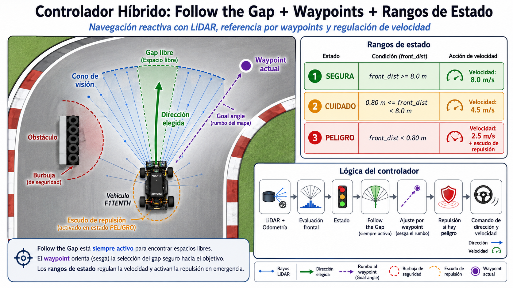

# Controlador Reactivo F1TENTH

## Follow the Gap con Waypoints y Rangos de Estado

Este proyecto implementa un controlador reactivo para un vehículo autónomo F1TENTH utilizando ROS 2.

El controlador combina tres elementos principales:

* **Follow the Gap**, para detectar espacios libres mediante el LiDAR y evitar obstáculos.
* **Waypoints**, para orientar al vehículo hacia la ruta correcta del circuito.
* **Rangos de estado**, para modificar la velocidad y activar un mecanismo de repulsión cuando el vehículo se encuentra demasiado cerca de un obstáculo.

El objetivo es permitir que el vehículo recorra el circuito de manera autónoma, manteniendo una trayectoria segura y reduciendo la velocidad cuando detecta condiciones de riesgo.

---

## Diagrama del controlador

La siguiente imagen representa el funcionamiento general del controlador:



El sistema utiliza las lecturas del LiDAR para encontrar un espacio libre, mientras que el waypoint actual sirve como referencia para elegir la dirección que más se aproxima a la ruta del circuito.

Los estados no reemplazan al algoritmo Follow the Gap. Su función es regular la velocidad y activar la repulsión de emergencia.

---

## Descripción del enfoque utilizado

### Follow the Gap

Follow the Gap es un algoritmo de navegación reactiva que utiliza las mediciones del LiDAR para determinar hacia dónde debe girar el vehículo.

El procedimiento general es el siguiente:

1. Recibir las distancias medidas por el LiDAR.
2. Limitar las lecturas a un rango máximo.
3. Analizar únicamente el cono frontal del vehículo.
4. Detectar el obstáculo más cercano.
5. Crear una burbuja de seguridad alrededor del obstáculo.
6. Buscar los rayos que representan espacios suficientemente libres.
7. Elegir una dirección segura.
8. Publicar el ángulo de dirección y la velocidad.

A diferencia de un controlador basado únicamente en waypoints, Follow the Gap permite reaccionar directamente ante obstáculos y paredes cercanas.

---

## Uso de waypoints

El circuito se representa mediante una lista de coordenadas:

```python
WAYPOINTS = [
    (-0.10, -0.50),
    (5.71, -21.61),
    (8.06, -25.40),
    ...
]
```

Cada waypoint contiene una posición global:

```text
(x, y)
```

La odometría permite conocer la posición actual del vehículo. A partir de esa posición se calcula el ángulo hacia el waypoint activo.

```python
goal_angle = math.atan2(
    wp[1] - self.y,
    wp[0] - self.x
) - self.yaw
```

Este ángulo no se utiliza directamente como comando de dirección.

Su función es orientar la elección realizada por Follow the Gap. Entre todos los rayos considerados seguros, el controlador selecciona el que se encuentre más cerca del ángulo del waypoint.

```python
gap_steer = float(
    self.angles[
        free_indices[
            np.argmin(
                np.abs(
                    self.angles[free_indices] - goal_angle
                )
            )
        ]
    ]
)
```

De esta manera:

* El LiDAR determina qué direcciones son seguras.
* Los waypoints indican qué dirección conviene seguir.
* Follow the Gap continúa siendo el responsable principal de evitar obstáculos.

Cuando el vehículo se encuentra a menos de `3.5 metros` del waypoint actual, el controlador avanza al siguiente.

```python
if dist_to_wp < 3.5:
    self.wp_idx = (self.wp_idx + 1) % self.n_wp
```

El operador módulo permite regresar al primer waypoint después de alcanzar el último.

---

## Rangos de estado

El controlador utiliza la distancia frontal media para clasificar el entorno en tres estados.

La distancia se calcula utilizando un pequeño cono frontal:

```python
front_dist = float(
    np.mean(
        r[np.abs(self.angles) < 0.15]
    )
)
```

Los estados son los siguientes:

| Estado  |                      Condición | Velocidad objetivo | Repulsión   |
| ------- | -----------------------------: | -----------------: | ----------- |
| Segura  |          `front_dist >= 8.0 m` |          `8.0 m/s` | Desactivada |
| Cuidado | `0.80 m <= front_dist < 8.0 m` |          `4.5 m/s` | Desactivada |
| Peligro |          `front_dist < 0.80 m` |          `2.5 m/s` | Activada    |

La selección se realiza mediante:

```python
if front_dist >= P.DIST_SAFE:
    target_speed = P.SPEED_MAX
    state = "SEGURA"

elif P.DIST_CAUTION <= front_dist < P.DIST_SAFE:
    target_speed = P.SPEED_CORNER
    state = "CUIDADO"

else:
    target_speed = P.SPEED_DANGER
    state = "PELIGRO"
```

Follow the Gap permanece activo en los tres estados.

Los estados modifican únicamente:

* La velocidad objetivo.
* La activación del escudo de repulsión.

---

## Burbuja de seguridad

El algoritmo busca el punto más cercano detectado por el LiDAR dentro del cono de conducción.

```python
closest_idx = int(
    np.argmin(
        np.where(
            driving_mask,
            proc_lidar,
            P.CLIP
        )
    )
)
```

Si el obstáculo se encuentra a menos de `3 metros`, se crea una burbuja de seguridad.

```python
if closest_dist < 3.0:
```

El radio físico de la burbuja se convierte en un ancho angular:

```python
b_half = math.atan2(
    P.BUBBLE_R,
    max(closest_dist, 0.1)
)
```

Después se eliminan temporalmente los rayos cercanos al obstáculo:

```python
proc_lidar[
    max(0, closest_idx - b_idx):
    min(self.nr, closest_idx + b_idx + 1)
] = 0.0
```

Esto evita que Follow the Gap seleccione una trayectoria que pase demasiado cerca de una pared.

---

## Selección del espacio libre

Un rayo se considera libre cuando su distancia es mayor o igual a:

```python
SAFE_GAP_DIST = 5.0
```

La máscara de espacios libres se calcula mediante:

```python
free_rays = proc_lidar >= P.SAFE_GAP_DIST
```

Si existen rayos libres, se elige el que se encuentre más cerca del ángulo del waypoint.

Si ningún rayo alcanza la distancia mínima, se selecciona el rayo con la mayor distancia disponible.

```python
if not np.any(free_rays):
    gap_steer = float(
        self.angles[np.argmax(proc_lidar)]
    )
```

Esto permite que el vehículo continúe buscando la salida más segura incluso cuando el espacio es reducido.

---

## Escudo de repulsión

Cuando el vehículo entra en el estado `PELIGRO`, se activa una corrección adicional de dirección.

```python
if state == "PELIGRO":
```

El controlador analiza los obstáculos dentro de un sector frontal de aproximadamente ±74 grados.

```python
active_mask = np.abs(self.angles) < 1.30
```

Cada obstáculo que se encuentra a menos de `0.80 metros` genera una fuerza de repulsión.

```python
force = P.REPULSION_K * (
    (P.DIST_CAUTION - dist_muro) /
    (dist_muro + 1e-3)
)
```

La fuerza aumenta cuando la distancia disminuye.

El signo del ángulo permite determinar hacia qué lado debe girar el vehículo:

```python
repulsion_steer_offset -= (
    force *
    np.sign(angle) *
    math.cos(angle)
)
```

Por ejemplo:

* Un obstáculo a la izquierda genera un giro hacia la derecha.
* Un obstáculo a la derecha genera un giro hacia la izquierda.

La dirección final combina Follow the Gap y la repulsión:

```python
chosen_steer = (
    gap_steer +
    repulsion_steer_offset
)
```

---

## Suavizado de dirección

El ángulo de dirección se limita al rango físico permitido:

```python
chosen_steer = float(
    np.clip(
        chosen_steer,
        -P.MAX_STEER,
        P.MAX_STEER
    )
)
```

El límite configurado es:

```python
MAX_STEER = 0.41
```

Esto equivale aproximadamente a 24 grados.

Posteriormente se aplica un filtro para evitar cambios instantáneos de dirección:

```python
steer = (
    P.STEER_SMOOTH * self.prev_steer +
    (1.0 - P.STEER_SMOOTH) * chosen_steer
)
```

La dirección anterior se almacena para utilizarla en el siguiente ciclo.

---

## Control de velocidad

La velocidad depende del estado actual.

Cuando el vehículo debe reducir la velocidad, se aplica una transición rápida:

```python
speed = (
    (1.0 - P.SPEED_BRAKE_K) * self.prev_speed +
    P.SPEED_BRAKE_K * target_speed
)
```

Cuando debe acelerar, se utiliza una interpolación hacia la nueva velocidad objetivo:

```python
speed = (
    0.20 * self.prev_speed +
    0.80 * target_speed
)
```

Finalmente, la velocidad calculada se almacena:

```python
self.prev_speed = speed
```

---

## Cronómetro de vueltas

El controlador también incluye un sistema de telemetría para contar y medir las vueltas.

Se utiliza una zona intermedia del circuito como checkpoint:

```python
if 20.0 < self.x < 25.0 and -26.0 < self.y < -20.0:
    self.crossed_checkpoint = True
```

La zona cercana al origen se utiliza como meta:

```python
if -1.8 < self.x < 1.8 and -2.2 < self.y < 2.2:
```

Una vuelta se registra solamente cuando:

1. El vehículo pasa por el checkpoint.
2. El vehículo regresa a la zona de meta.

Esto evita que se registren varias vueltas mientras el vehículo permanece cerca del punto inicial.

El controlador muestra:

* Número de vuelta.
* Tiempo de la vuelta.
* Mejor tiempo registrado.

Ejemplo:

```text
==========================================
🏁 ¡VUELTA 2 COMPLETADA!
⏱️ Tiempo: 34.821 s | 🏆 Mejor: 33.905 s
==========================================
```

---

# Estructura del código

El archivo principal se organiza en los siguientes bloques.

## 1. Importaciones

```python
import rclpy
from rclpy.node import Node
import numpy as np
from sensor_msgs.msg import LaserScan
from ackermann_msgs.msg import AckermannDriveStamped
from nav_msgs.msg import Odometry
import math
import time
```

Estas librerías permiten trabajar con:

* ROS 2.
* LiDAR.
* Odometría.
* Comandos Ackermann.
* Operaciones matemáticas.
* Arreglos NumPy.
* Cronometraje.

---

## 2. Lista de waypoints

```python
WAYPOINTS = [
    ...
]
```

Contiene las coordenadas utilizadas como referencia global de navegación.

---

## 3. Clase de parámetros

```python
class P:
```

Contiene los valores configurables del controlador.

### Parámetros principales

| Parámetro            |  Valor | Descripción                          |
| -------------------- | -----: | ------------------------------------ |
| `CLIP`               | `10.0` | Distancia máxima procesada del LiDAR |
| `MAX_STEER`          | `0.41` | Ángulo máximo de dirección           |
| `STEER_SMOOTH`       | `0.15` | Suavizado de dirección               |
| `SAFE_GAP_DIST`      |  `5.0` | Distancia mínima de un espacio libre |
| `BUBBLE_R`           | `0.90` | Radio de la burbuja de seguridad     |
| `MAX_GAP_LOOK_ANGLE` | `1.05` | Cono frontal analizado               |
| `DIST_SAFE`          |  `8.0` | Límite del estado seguro             |
| `DIST_CAUTION`       | `0.80` | Límite del estado de peligro         |
| `REPULSION_K`        | `1.25` | Intensidad de la repulsión           |
| `SPEED_MAX`          |  `8.0` | Velocidad en estado seguro           |
| `SPEED_CORNER`       |  `4.5` | Velocidad en estado de cuidado       |
| `SPEED_DANGER`       |  `2.5` | Velocidad en estado de peligro       |
| `SPEED_BRAKE_K`      | `0.85` | Tasa de reducción de velocidad       |

---

## 4. Clase principal

```python
class UnifiedRacer(Node):
```

Representa el nodo de ROS 2.

La clase contiene tres métodos principales:

### `__init__()`

Inicializa:

* Publicador de comandos.
* Suscripción al LiDAR.
* Suscripción a la odometría.
* Waypoints.
* Variables de dirección y velocidad.
* Variables de telemetría.

### `on_odom()`

Procesa la odometría y actualiza:

* Posición `x`.
* Posición `y`.
* Orientación `yaw`.
* Waypoint activo.
* Checkpoint.
* Cronómetro de vueltas.

### `on_scan()`

Procesa el LiDAR y realiza:

* Limpieza de lecturas.
* Evaluación del estado.
* Aplicación de Follow the Gap.
* Cálculo del rumbo hacia el waypoint.
* Creación de la burbuja.
* Selección del espacio libre.
* Aplicación de repulsión.
* Suavizado.
* Publicación de dirección y velocidad.

---

## 5. Función principal

```python
def main(args=None):
```

Inicializa ROS 2, crea el nodo y mantiene su ejecución.

```python
rclpy.spin(node)
```

El nodo se detiene correctamente al presionar:

```text
Ctrl + C
```

---

# Flujo completo del controlador

El funcionamiento puede resumirse de la siguiente manera:

```text
Lectura del LiDAR
        ↓
Limpieza y limitación de distancias
        ↓
Evaluación de distancia frontal
        ↓
Selección de estado
        ↓
Cálculo del ángulo hacia el waypoint
        ↓
Selección del cono frontal
        ↓
Detección del obstáculo más cercano
        ↓
Creación de burbuja de seguridad
        ↓
Búsqueda de espacios libres
        ↓
Selección del gap más cercano al waypoint
        ↓
Repulsión si el estado es PELIGRO
        ↓
Suavizado de dirección y velocidad
        ↓
Publicación del comando Ackermann
```

---

# Estructura del repositorio

Una posible estructura para el repositorio es:

```text
f1tenth-follow-the-gap/
├── README.md
├── assets/
│   └── controlador_hibrido_follow_the_gap.png
├── src/
│   └── follow_the_gap_controller.py
├── package.xml
├── setup.py
├── setup.cfg
└── resource/
```

Si el controlador se encuentra dentro de un workspace de ROS 2, la estructura puede ser:

```text
f1tenth_ws/
├── src/
│   └── f1tenth_controller/
│       ├── README.md
│       ├── assets/
│       │   └── controlador_hibrido_follow_the_gap.png
│       ├── f1tenth_controller/
│       │   ├── __init__.py
│       │   └── follow_the_gap_controller.py
│       ├── package.xml
│       ├── setup.py
│       └── setup.cfg
├── build/
├── install/
└── log/
```

---

# Requisitos

Para ejecutar el controlador se necesita:

* Ubuntu con ROS 2 instalado.
* Simulador o vehículo F1TENTH configurado.
* Python 3.
* NumPy.
* Mensajes `sensor_msgs`.
* Mensajes `nav_msgs`.
* Mensajes `ackermann_msgs`.
* Un tópico LiDAR disponible en `/scan`.
* Un tópico de odometría disponible en `/ego_racecar/odom`.
* Un controlador que reciba comandos en `/drive`.

---

# Instalación

## 1. Crear un workspace

```bash
mkdir -p ~/f1tenth_ws/src
cd ~/f1tenth_ws/src
```

## 2. Clonar el repositorio

```bash
git clone <URL_DEL_REPOSITORIO>
```

Ejemplo:

```bash
git clone https://github.com/usuario/f1tenth-follow-the-gap.git
```

## 3. Instalar dependencias

Desde la raíz del workspace:

```bash
cd ~/f1tenth_ws
rosdep install --from-paths src --ignore-src -r -y
```

Si NumPy no se encuentra instalado:

```bash
pip3 install numpy
```

## 4. Compilar el workspace

```bash
cd ~/f1tenth_ws
colcon build --symlink-install
```

## 5. Cargar el entorno

```bash
source install/setup.bash
```

Este comando debe ejecutarse en cada terminal nueva.

También puede agregarse al archivo `.bashrc`:

```bash
echo "source ~/f1tenth_ws/install/setup.bash" >> ~/.bashrc
source ~/.bashrc
```

---

# Instrucciones de ejecución

## 1. Iniciar el simulador

Primero debe ejecutarse el simulador F1TENTH o el entorno que publique los tópicos requeridos.

El controlador espera recibir:

```text
/scan
/ego_racecar/odom
```

Y publica comandos en:

```text
/drive
```

Se puede verificar que los tópicos estén disponibles mediante:

```bash
ros2 topic list
```

---

## 2. Verificar el LiDAR

```bash
ros2 topic echo /scan
```

También se puede revisar la frecuencia:

```bash
ros2 topic hz /scan
```

---

## 3. Verificar la odometría

```bash
ros2 topic echo /ego_racecar/odom
```

---

## 4. Ejecutar el controlador

Desde una terminal con el workspace cargado:

```bash
cd ~/f1tenth_ws
source install/setup.bash
ros2 run f1tenth_controller follow_the_gap_controller
```

Donde:

```text
f1tenth_controller
```

es el nombre del paquete y:

```text
follow_the_gap_controller
```

es el nombre del ejecutable configurado en `setup.py`.

Si el paquete o ejecutable tienen nombres diferentes, deben reemplazarse en el comando.

---

## 5. Verificar los comandos publicados

```bash
ros2 topic echo /drive
```

También puede revisarse la frecuencia de publicación:

```bash
ros2 topic hz /drive
```

---

# Ejecución directa con Python

Si el archivo se ejecuta directamente y no como paquete ROS 2, primero debe tener permisos de ejecución.

```bash
chmod +x follow_the_gap_controller.py
```

Después se puede ejecutar mediante:

```bash
python3 follow_the_gap_controller.py
```

Sin embargo, la forma recomendada dentro de ROS 2 es:

```bash
ros2 run f1tenth_controller follow_the_gap_controller
```

---

# Tópicos utilizados

| Tópico              | Tipo de mensaje                            | Función                |
| ------------------- | ------------------------------------------ | ---------------------- |
| `/scan`             | `sensor_msgs/msg/LaserScan`                | Lecturas del LiDAR     |
| `/ego_racecar/odom` | `nav_msgs/msg/Odometry`                    | Posición y orientación |
| `/drive`            | `ackermann_msgs/msg/AckermannDriveStamped` | Dirección y velocidad  |

---

# Mensaje de salida

El controlador publica mensajes del tipo:

```text
ackermann_msgs/msg/AckermannDriveStamped
```

Los campos principales son:

```python
msg.drive.steering_angle
msg.drive.speed
```

* `steering_angle`: ángulo de dirección en radianes.
* `speed`: velocidad objetivo del vehículo.

---

# Ajuste de parámetros

Los parámetros pueden modificarse dentro de la clase `P`.

Por ejemplo, para reducir la velocidad máxima:

```python
SPEED_MAX = 6.0
```

Para crear una burbuja de seguridad más grande:

```python
BUBBLE_R = 1.10
```

Para considerar libres únicamente los espacios con más distancia:

```python
SAFE_GAP_DIST = 6.0
```

Para hacer la dirección más suave:

```python
STEER_SMOOTH = 0.50
```

Debe tenerse en cuenta que un valor alto de `STEER_SMOOTH` hace que el vehículo conserve durante más tiempo la dirección anterior.

---

# Posibles problemas

## El vehículo no se mueve

Verificar que el controlador publique en `/drive`:

```bash
ros2 topic echo /drive
```

También se debe confirmar que el simulador utilice el mismo tópico.

---

## El controlador no recibe LiDAR

Verificar:

```bash
ros2 topic list
ros2 topic echo /scan
```

Si el LiDAR utiliza otro tópico, debe cambiarse la suscripción:

```python
self.create_subscription(
    LaserScan,
    '/nombre_del_topic',
    self.on_scan,
    10
)
```

---

## El waypoint no avanza

Comprobar que la odometría se publique correctamente:

```bash
ros2 topic echo /ego_racecar/odom
```

También se puede aumentar temporalmente la distancia de aceptación:

```python
if dist_to_wp < 4.0:
```

---

## El vehículo gira de forma brusca

Se puede aumentar:

```python
STEER_SMOOTH
```

Por ejemplo:

```python
STEER_SMOOTH = 0.40
```

---

## El vehículo pasa muy cerca de las paredes

Se puede aumentar:

```python
BUBBLE_R
```

o reducir:

```python
DIST_CAUTION
```

También puede aumentarse la fuerza de repulsión:

```python
REPULSION_K
```

Los cambios deben realizarse gradualmente para evitar oscilaciones.

---

# Conclusión

El controlador implementa una estrategia híbrida de navegación reactiva.

Follow the Gap se encarga de detectar espacios libres y evitar obstáculos. Los waypoints proporcionan una referencia global para mantener al vehículo dentro de la ruta del circuito. Los rangos de estado regulan la velocidad y activan una corrección adicional cuando existe un riesgo inmediato de colisión.

Esta combinación permite que el vehículo:

* Reaccione ante obstáculos mediante el LiDAR.
* Mantenga una orientación general hacia la ruta.
* Reduzca la velocidad en zonas comprometidas.
* Active una repulsión de emergencia.
* Registre el número y tiempo de las vueltas.

El resultado es un controlador que combina navegación local, orientación global y adaptación de velocidad en una única estrategia.

